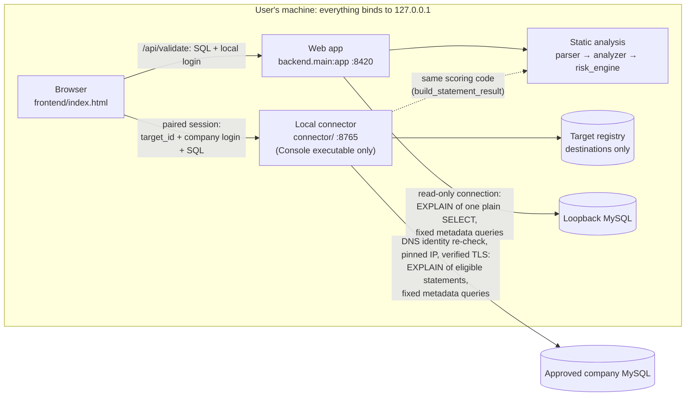

# Architecture

This document describes how MySQL DBA Validator is built today: its
components, how a validation request flows, what is sent to a database, how
scores are computed and what a result claims about database evidence. For the
security model and vulnerability reporting see [SECURITY.md](SECURITY.md); for
what has been tested see [VERIFICATION.md](VERIFICATION.md).

## Components

| Component | Code | Role |
| --- | --- | --- |
| Page | `frontend/index.html` | Single static page, no build step. Sends SQL to the web app, or to the connector for company targets. |
| Web app | `backend/main.py` (FastAPI) | Serves the page and `/api/*` on `127.0.0.1:8420`. Runs static analysis and local evidence. |
| Static analysis | `backend/parser.py`, `analyzer.py`, `risk_engine.py`, `evidence.py`, `recommendations.py`, `models.py` | Turns SQL into facts (SQLGlot, MySQL dialect) and applies explicit rules: score, findings, checklist, confidence. Needs no database. |
| Local evidence | `backend/db.py`, `db_evidence.py`, `metadata.py` | One read-only connection per validation to loopback MySQL, with the login supplied for that validation. |
| Evidence scoring | `backend/evidence_scoring.py`, `metadata_scoring.py` (M1), `m2_scoring.py` (M2) | Small, bounded adjustments to the static score from collected evidence. |
| Evidence state | `backend/evidence_state.py` | Builds each statement's `evidence` object from what the collectors returned. Pure result assembly: no database access. |
| Local connector | `connector/` (`launcher.py`, `server.py`, `policy.py`, `registry_store.py`) | Separate service on `127.0.0.1:8765` for operator-approved company targets. See [connector/README.md](connector/README.md). |
| Windows launcher | `release/launcher.py`, `release/mysql-dba-validator.spec` | Starts the packaged web app (and, in the Console executable, the connector). |

The parser produces facts; it does not decide anything about safety. Safety
decisions about what may be sent to a database are made in the evidence
collectors, on the exact text that would be sent.

## Local validation flow

1. The page posts SQL (up to 64 KiB, up to 16 statements) to `/api/validate`,
   optionally with a MySQL login and a selected database.
2. The backend classifies the target from its host and port. Only loopback
   MySQL on port 3306 is local. The request's deprecated `mode` field does not
   take part in that decision. A remote host is never connected to from here:
   the web app answers `delegated_to_connector` for an approved company target
   and `permission_denied` otherwise, and refuses company credentials.
3. Every statement is parsed, analysed and scored statically.
4. If a login and database were supplied, one evidence connection is opened
   with that login and bound to that database. Its session is set to read-only
   transactions first; if that fails, the connection is closed and no evidence
   is collected.
5. For each statement the collectors run (see the rules below), the scoring
   adjustments are applied, and the evidence state is built.
6. The connection is closed and the batch result is returned. The overall
   score is the highest statement score, not a sum.

Without a login and database, the result is static analysis only and says so.

## Remote validation flow

The remote path exists so company credentials and company network access
stay on the user's machine, under an operator's explicit approval, instead of
passing through a web API.

1. An operator starts `MySQL-DBA-Validator Console.exe` (or
   `python -m connector`) and registers and approves targets by typing
   commands in its console. Approval snapshots the host's DNS identity.
   Browser sessions cannot register, approve, revoke or delete targets. The
   connector's target-management HTTP routes require an operator-scoped
   session, and the packaged launcher issues only browser-scoped pairing
   sessions, so in the packaged app target management is done in the
   connector console.
2. The page pairs with the connector using a single-use, five-minute code
   printed in that console. The resulting browser session lives in memory and
   may call only a fixed list of routes.
3. The page lists approved targets and refers to one by `target_id`. It cannot
   supply a host, port, IP or TLS setting.
4. Database discovery and validation each send the user's MySQL login in the
   request body. For every connection the connector re-resolves the target,
   requires the address set to match the approved snapshot, connects to the
   validated IP, and requires TLS verified against the configured CA (with
   hostname checking). Without a CA, company operations fail before any TCP
   connection is opened.
5. A discovered database list is stored per target and browser session, bound
   to a keyed fingerprint of the MySQL username. Validation against a database
   requires it to be in that list. This binding is not authorization: MySQL
   still decides what the login may do.
6. The connector runs the same scoring and result assembly as the web app
   (`backend.main.build_statement_result` and `batch_result`), so local and
   remote results have the same shape and meaning.

## What may be sent to a database

The validator never executes submitted SQL, never runs `EXPLAIN ANALYZE`,
and has no endpoint that runs user-supplied SQL (`/api/evidence` returns
`evidence_queries_disabled`). Evidence queries are built by the application.

| | Local evidence (web app) | Remote evidence (connector) |
| --- | --- | --- |
| Connection | One per validation, login from the request, session set to read-only transactions | One per operation, login from the request, approved target only, pinned IP, verified TLS |
| `SELECT` plan | `EXPLAIN` only when the exact outgoing text is one plain `SELECT` | `EXPLAIN` of the parser-regenerated `SELECT` |
| `UPDATE` / `DELETE` plan | Never requested (`plan_not_collected_read_only`): MySQL refuses `EXPLAIN` of writes in a read-only transaction | `EXPLAIN` of the parser-regenerated statement |
| `SELECT … INTO`, or a `SELECT` the parser could only read permissively | Not eligible (`plan_not_eligible`), nothing sent | Not eligible (`plan_not_eligible`), nothing sent |
| Other statements | No plan | No plan |
| Metadata | Fixed, parameterised `information_schema` queries for the referenced tables | The same queries, only for the selected discovered database |
| Other | `SELECT DATABASE()` after a plan | `SELECT DATABASE()` after a plan; fixed, capped `SHOW DATABASES` for discovery |

MySQL error 1792 (read-only transaction) on the local connection is reported,
never retried. The web app's separate connection-test and database-discovery
endpoints accept only a loopback MySQL host: the test only opens and closes a
connection, and discovery runs a capped `SHOW DATABASES`.

MySQL account privileges are the authorization boundary: `EXPLAIN` needs the
same privileges as the statement it explains. The application's restrictions
are a safety layer on top of them. The read-only session on the local
connection is defense in depth; the remote connection has no read-only
session, because remote `UPDATE`/`DELETE` plans require one that is not.

## Risk scoring

- **Deterministic first.** Findings and scores come from parser facts and
  explicit rules. No LLM makes risk or security decisions.
- **Risk levels.** Scores run from 0 to 100: `LOW` below 20, `MEDIUM` from 20,
  `HIGH` from 50, `CRITICAL` from 80.
- **Severity is not certainty.** An `UPDATE` with a real `WHERE` clause is
  reported with explicit row-impact uncertainty instead of an invented number.
- **`LIMIT` is not a universal safety rule.** Missing `LIMIT` on a write is not
  penalised by itself.
- **MySQL transaction semantics.** Transaction advice is scoped to DML,
  because many MySQL DDL statements commit implicitly.
- **Bounded `EXPLAIN` adjustments** (only when a plan was collected, only for
  `UPDATE`/`DELETE`, never for a statement already `CRITICAL`):
  - +10 when `EXPLAIN` indicates a full table scan;
  - +10 when the optimizer estimates at least 10,000 rows;
  - −3 for confirmed `const`/`eq_ref`/`ref` access with a key and no full
    scan.

  `estimated_rows` is an optimizer estimate, not an affected-row count.
- **Metadata adjustments**, each +5 and each requiring an `UPDATE`/`DELETE`
  with a `WHERE` clause, a collected plan showing a full table scan, available
  metadata, and a statement that is not already `CRITICAL`:
  - **M1** — exactly one matched table, complete metadata,
    `information_schema` `TABLE_ROWS` of at least 100,000, and the
    high-estimated-rows adjustment not applied (the optimizer estimated fewer
    than 10,000 rows for a large table).
  - **M2** — one table, a direct `column = literal` predicate on it, and
    index statistics showing no index whose leading column is that column.

  Both depend on a collected `UPDATE`/`DELETE` plan, so in practice they arise
  only on the remote path.
- **Missing evidence never lowers a score.** Every adjustment is a no-op
  without the evidence it needs, and `CRITICAL` is never reduced.
- **Confidence is about the assessment, not the evidence.** `confidence` is
  `HIGH`, `LIMITED` or `LOW` and comes from the SQL itself: `LIMITED` for
  writes and `CALL`, whose impact depends on rows the validator cannot count,
  and `LOW` when the SQL could not be parsed. Database evidence never raises
  it: no evidence the validator collects gives the number of rows a statement
  would affect.

## Evidence model

Each statement result has an `evidence` object, the source of truth for what
evidence it has. It is built once, in `backend/evidence_state.py`, and
everything else that talks about evidence is derived from it.

| Field | Values |
| --- | --- |
| `connection.state` | `not_attempted`, `connected`, `failed` (with a `reason` such as `auth_failed` or `unreachable`) |
| `plan.state` | `collected`, `not_collected_read_only` (local `UPDATE`/`DELETE`), `not_eligible` (a `SELECT` that is not one plain `SELECT`), `not_supported` (no plan for this statement), `failed`, `not_attempted` |
| `metadata.state` | `collected` (with `tables: [{name, found}]`), `failed` (with a `reason` such as `timeout` or `permission_denied`), `not_applicable` (no table), `not_attempted` |
| `overall` | `static_only`, `collected`, `partial` (some evidence collected, some failed), `unavailable` (nothing collected: the connection failed, or it succeeded but every requested evidence failed), `not_applicable` |

`collected` means MySQL returned that evidence, not that it is complete:
execution-plan rows and table rows are estimates, and `found: false` means
`information_schema.TABLES` returned no row for that name in the schema it was
looked up in (the selected database unless the SQL names another). The
`tables` names are the parser's table references, so they can include names
that are not tables.

The batch response's `evidence_summary` counts these states across all
statements and sets `partial` when some evidence was collected and some
failed. `analysis_mode` remains as a compatibility label derived from these
states: `DATABASE_EVIDENCE` means at least one plan was collected, not that
all evidence was; `STATIC_DATABASE_UNAVAILABLE`, shown as "Static + database
evidence unavailable", does not by itself mean the connection failed
(`connection.state` says that). Local and remote results use the same states
with the same meaning; only how evidence is collected differs.

## Credentials and stored data

- MySQL logins are typed in the page and sent in the body of each operation.
  They are used for that operation only and are not written to disk, the
  target registry, logs, URLs or browser storage. There is no credential
  vault. (Python cannot guarantee that memory is wiped.)
- Company logins go only to the connector; the web app refuses them.
- The page stores only its theme choice in browser storage.
- Per-user data lives in `%LOCALAPPDATA%\MySQLDBAValidator\`: the connector's
  target registry (destinations and approval state, never credentials) and
  `logs\backend.log`. The program folder is never written to.

## Packaged application

The Windows release contains two executables built from the same code:

- `MySQL-DBA-Validator.exe` runs the web app only, with no console window. It
  opens the page in the default browser and stops on its own about 15 minutes
  after the last page closed (the page sends a heartbeat while open). The
  backend runs in a Windows Job Object, so it stops if the launcher is killed.
- `MySQL-DBA-Validator Console.exe` runs the same web app plus the local
  connector. Its console window is the connector's operator console.

Build, audit and release steps are in [RELEASING.md](RELEASING.md).

## Deliberately not in the architecture

- No endpoint that executes submitted SQL, and no generic query endpoint.
- No writable local evidence connection and no switch to enable one.
- No credential storage of any kind.
- No path from the browser to a company database that bypasses the connector.
- No user authentication: the tool is for one user on their own machine, or a
  trusted self-hosted setup (see "Running beyond one machine" in the
  [README](README.md#running-beyond-one-machine)).
