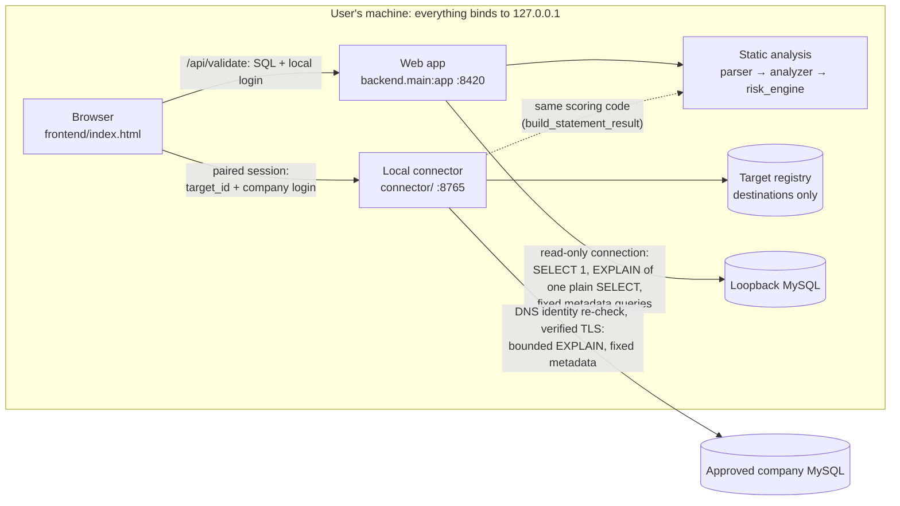

# Contributing to MySQL DBA Validator

MySQL DBA Validator helps a DBA review MySQL SQL before it is run. It
classifies statements, scores risk deterministically and, when asked, collects
limited read-only evidence from a database. It supports a DBA's judgement; it
does not guarantee that SQL is safe.

The project is small, but people use its output to decide whether to run SQL
against real databases. A change to parsing, scoring, evidence collection,
credential handling or connector behaviour can make the tool report something
it does not actually know. Contributions are welcome. Before you change
anything that touches a database, read this guide and [SECURITY.md](SECURITY.md).

## Where things are documented

| Document | Covers |
| --- | --- |
| [README.md](README.md) | What the tool does, how to use it, security model, verification status, scoring |
| [SECURITY.md](SECURITY.md) | Authoritative security model, known limitations, private vulnerability reporting |
| [connector/README.md](connector/README.md) | Local connector: configuration, operator console, sessions, credentials |
| CONTRIBUTING.md (this file) | Development setup, architecture, review areas, tests, pull requests |
| [RELEASING.md](RELEASING.md) | Maintainer-only build and release procedure |
| [CODE_OF_CONDUCT.md](CODE_OF_CONDUCT.md) | How we treat each other |

Where this guide and SECURITY.md differ, SECURITY.md is correct and this
guide needs fixing.

## Development setup

The project is developed and tested on Windows with Python 3.14. Other
platforms may work but are not tested. All commands are PowerShell, run from
the repository root.

```powershell
python -m venv .venv
.\.venv\Scripts\Activate.ps1
pip install -r requirements.txt
```

`requirements.txt` includes the test dependencies. Run the web app and, if you
are working on the remote/company workflow, the connector in a second terminal:

```powershell
uvicorn backend.main:app --reload --host 127.0.0.1 --port 8420
python -m connector --allow-origin http://localhost:8420
```

Open `http://localhost:8420`. The frontend is a single static page,
`frontend/index.html`, served by the backend. It has no build step: edit it and
reload. The connector's options (`--tls-ca`, `--registry`, operator commands)
are in [connector/README.md](connector/README.md).

You do not need a MySQL server to develop or run the tests. For local evidence
by hand, use a MySQL server on your own machine and enter a login in the page.
No configuration file is needed.

## Architecture



- **Static analysis** needs no database. `backend/parser.py` turns SQL into
  facts using SQLGlot (MySQL dialect) and does not decide anything about
  safety. `backend/risk_engine.py` applies explicit rules to produce the score,
  findings and checklist. `backend/analyzer.py`, `evidence.py` and
  `recommendations.py` build the structured analysis.
- **Local evidence** (`backend/db.py`, `db_evidence.py`, `metadata.py`) opens
  one connection per validation to a loopback MySQL with the login typed for
  that validation. The connection is set to read-only transactions first; if
  that fails, no evidence is collected. A plan request is sent only when the
  exact outgoing text is `EXPLAIN` of one plain `SELECT`. Local `UPDATE` and
  `DELETE` get no plan by design (`plan_not_collected_read_only`).
- **Evidence scoring** (`backend/evidence_scoring.py`, `metadata_scoring.py`,
  `m2_scoring.py`) applies small, bounded adjustments to the static score.
  "How scoring works" in the README describes the current rules.
- **Remote/company evidence** goes only through the local connector. The
  browser refers to a target by its `target_id`. It cannot supply a host. An
  operator registers and approves targets in the connector's console, never
  over HTTP. Each connection re-checks the approved DNS identity and requires
  TLS verified against a configured CA. Remote results are scored by the same
  function as local results, but the connection rules differ. The read-only
  session and the "plain `SELECT` only" plan rule above belong to local
  evidence. Remote evidence is limited by the connector's own rules:
  approved target, verified TLS, bounded `EXPLAIN` and fixed metadata queries
  (see [connector/README.md](connector/README.md)).
- **Credentials** are typed in the page and sent with each operation. They are
  used for that operation and never stored. Company credentials go to the
  connector only and never reach the web app. The target registry records
  where the connector may connect, never who is connecting.

The connector exists so company credentials and company network access stay on
the user's machine, under an operator's explicit approval, instead of passing
through a web API. The backend classifies every target from its host and port,
and the browser cannot override that.

There is no endpoint that runs SQL supplied by the user, and the submitted SQL
is never executed. The public `/api/evidence` route deliberately returns
`evidence_queries_disabled`. Evidence queries are built by the application
from a short, fixed list. That is a design decision, not a missing feature.

## What to work on

### Good first contributions

- Documentation fixes, especially where docs or docstrings no longer match
  the code. For example, the header comment of `backend/db.py` still
  describes environment-variable configuration that local evidence no longer
  uses. A comment-only fix there is fine; changing the code is not a first
  contribution.
- Test cases for SQL the parser already handles, in `tests/test_parser.py`
  and `tests/test_risk_engine.py`, that pin down current behaviour. If the
  current behaviour looks wrong, open an issue instead of writing a test that
  locks it in.
- Regression tests for a bug you found, even without a fix.
- Accessibility and usability fixes in `frontend/index.html`, such as labels,
  keyboard focus, contrast and wording, as long as they do not change what is
  sent, where it is sent or what is stored.
- Readable messages for error codes the page shows raw. For example,
  `database_connection_failed` from the connector has no entry in
  `CONNECTOR_ERROR_MESSAGES`.

### Intermediate contributions

- Parser coverage for MySQL syntax that currently fails to parse, with tests.
  The parser also decides which statements get `EXPLAIN` evidence and
  produces the text that is explained. So a change to how a statement is
  classified or regenerated falls under the next section.
- New static findings or checklist items. If a finding changes a score, it
  also falls under the next section.
- Larger UI improvements that keep the existing request flow.
- Test helpers and fakes, in the style of `tests/local_evidence.py`, that let
  more behaviour be tested without a real server.

### Changes that need maintainer, DBA or security review

Open an issue to discuss the design before you write code for any of these:

- What SQL is sent to a database: `EXPLAIN` construction, metadata queries,
  `SHOW DATABASES` discovery, or any new query.
- Any transformation or rewriting of submitted SQL, including changes to
  statement classification that decide what is explained.
- Local database evidence: what is collected, when it is skipped, and how its
  absence is reported.
- Connection behaviour: the local evidence connection, read-only session
  setup, timeouts, connection lifecycle and target classification in
  `backend/main.py`.
- Anything that handles credentials, in any component.
- The connector (`connector/`): origins, pairing, sessions and scopes, the
  target registry, DNS and TLS checks, request size limits and the operator
  console.
- Risk scores and their adjustments: point values, thresholds, and which
  facts count as evidence.
- Confidence, analysis mode and evidence statuses: what the result claims to
  know.
- Frontend code that builds requests, picks the web app or the connector, or
  uses browser storage.
- Packaging and release: `release/`, the PyInstaller spec, the artifact audit,
  the smoke test, `.github/workflows/`, and dependency versions, because
  `release/requirements-build.txt` must be regenerated when
  `requirements.txt` changes.

### Changes that will not be accepted

Some changes look small but remove a safety property:

- A flag, setting or environment variable that turns safety checks off.
- A way to execute submitted SQL, `EXPLAIN ANALYZE`, or a generic query
  endpoint.
- A writable local evidence connection, or plan requests for anything other
  than a verified plain `SELECT` on it.
- Reaching company databases without the connector, or a fallback to the web
  app when the connector is unavailable.
- Accepting a host, port or TLS setting for company targets from the browser,
  or approving targets over HTTP.
- Storing credentials: on disk, in the registry, in browser storage, in a
  vault or credential manager, in logs, URLs, error messages or responses.
- Reporting evidence that was not collected, or treating missing evidence as
  a sign that SQL is safe.

**Looks small, needs design first.** "Rewrite `UPDATE`/`DELETE` as `SELECT`
so local `EXPLAIN` can run" sounds like a small parser task, but it is not a
beginner task. The
rewritten statement is a different statement. Multi-table updates, `ORDER BY
... LIMIT`, subqueries on the target table and locking behaviour may not carry
over, so its plan is not evidence about the SQL under review. Whether and how
to approximate a write's plan is an evidence-model decision. Raise it in an
issue.

## Testing

Each behaviour change needs:

1. tests for the new behaviour;
2. a regression test for any bug it fixes, where practical;
3. a passing full test suite;
4. security or DBA review, if it falls into one of the review areas above.

```powershell
python -m pytest tests/test_parser.py -q   # focused run while you work
python -m pytest -q                        # full suite before opening a PR
pip check
```

- New SQL handling needs tests that show what is classified and what is
  flagged.
- Score changes need tests that assert the exact score or adjustment, so a
  later change can't shift it silently.
- Evidence changes need both sides tested: what is collected when allowed,
  and what is refused, not sent, or reported unavailable when not allowed.
- Credential and connector changes need explicit tests that values do not
  leak into responses, errors, logs or persisted files. The existing tests in
  `tests/test_validation_error_redaction.py`,
  `tests/test_connector_credentials.py` and
  `tests/test_security_hardening.py` show the pattern.
- The suite needs no MySQL server and no real credentials. Tests use fake
  connections and mocked DNS lookups. New tests should do the same.
- Never weaken a safety check, or edit an existing test, only to make a test
  pass. If a requirement has really changed, replace the old test with one for
  the new contract and explain why in the PR.

Be precise about what was verified. A unit or `TestClient` test, a test
against a running process, and a run against real MySQL or company
infrastructure are different levels. The README's verification status table
tracks them. Do not claim a level you did not reach.

If you change `release/`, also run the build and smoke test described in
[RELEASING.md](RELEASING.md).

## Workflow and pull requests

Changes reach `main` only through pull requests:

1. Fork the repository, or create a branch if you have write access. Branch
   from `main` and give the branch a short descriptive name, for example
   `test/parser-join-cases` or `docs/connector-options`.
2. Make the change and its tests on that branch.
3. Run the full test suite and `pip check` locally. The repository's GitHub
   Actions workflow runs only for release tags, not for pull requests, so
   your local run is the check.
4. Open a pull request against `main` and answer the questions below.
5. A maintainer reviews it, requests DBA or security review if needed, and
   decides whether and when to merge it.

Do not push directly to `main`. Merging is the maintainers' decision.
Releases are made only by maintainers, following
[RELEASING.md](RELEASING.md). Contributors do not tag versions, publish
releases or change `APP_VERSION`.

Keep each pull request focused on one change. Recent commits use short
prefixes such as `feat:`, `test:` and `docs:`. In the description, answer:

- **What changed, and why?**
- **Tests:** what was added or updated, and what level of verification it
  reaches.
- **Behaviour change:** could an existing result change, such as a score,
  finding, confidence or evidence status?
- **Does it affect any of these?** Mark yes or no and explain each yes:
  SQL parsing · risk scoring · confidence/evidence · SQL sent to a database ·
  database connections · credentials · connector/remote targets ·
  packaging/release.

A pull request that touches a review area may need more discussion before it
is merged.

## Security boundaries for contributors

[SECURITY.md](SECURITY.md) is the authoritative model. When you write code,
the rules that matter most are:

- Credentials are per request and never persisted, logged, put in URLs or
  returned in responses, including validation errors.
- Company database access goes only through the connector, only to
  operator-approved targets, and only with verified TLS. Without a CA, company
  operations fail closed.
- No endpoint runs user-supplied SQL. Evidence queries are fixed or bounded
  and built by the application.
- Local evidence uses a read-only connection, and only a verified plain
  `SELECT` gets a plan request.
- MySQL privileges are the authorization boundary. The application's
  restrictions are a safety layer on top, not a replacement.
- Results never claim more evidence than was collected.

To report a vulnerability, follow [SECURITY.md](SECURITY.md). Do not open a
public issue.

## What not to commit

`.gitignore` already excludes most of these. Do not work around it.

- `.env` files. Only `.env.example` is tracked, and it holds no secrets.
- Credentials, keys and certificates (`*.pem`, `*.key`, `*.pfx`, `*.p12`).
- Connector target registries (`connector-targets*.json`) and logs (`*.log`).
- Build output (`build/`, `dist/`, `*.sha256`). Release binaries are
  published as GitHub Release assets only.
- Virtual environments, editor settings (`.vscode/`, `.idea/`), `scratch/`
  and local AI-assistant context files (`.claude/`, `CLAUDE.md`,
  `AGENTS.md`).
- Real hostnames, company names, customer SQL, schema names or data in tests,
  fixtures, screenshots or issues. Use made-up values, as the existing tests
  do.

## Questions and good first issues

Use GitHub Issues on this repository for questions, bug reports and
proposals. Security vulnerabilities are the exception and go through
[SECURITY.md](SECURITY.md). If you are unsure whether a change falls into a review area, ask
before you write the code. Mention the area in the issue and describe what
you plan to change.

A good first issue for this project is:

- **bounded:** one file or one behaviour;
- **deterministic:** the result is the same on every run;
- **testable:** a test can show it works;
- **low risk:** it cannot change what is sent to a database or what a result
  claims;
- **away from security boundaries:** no credentials, connector,
  evidence-collection or scoring changes.

Test cases for existing parser behaviour, documentation corrections and
readable error messages meet all five. A new evidence query, a scoring tweak
or a SQL rewrite does not, however small the diff.

## License

By contributing, you agree that your contributions are licensed under the
project's [MIT License](LICENSE).
