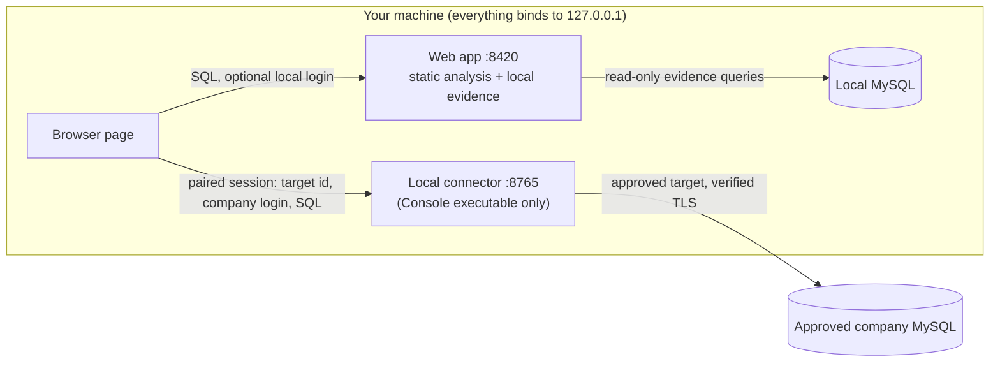

# MySQL DBA Validator

**Review MySQL SQL before execution.**

MySQL DBA Validator is a local-first tool for DBAs who review SQL from
database tickets. Paste SQL and get the statement classification, a
deterministic risk score, confidence, findings and a DBA review checklist.
Optionally, it collects read-only database evidence (execution plans and
table metadata) to refine the result. No LLM makes risk or security
decisions.

It supports a DBA's judgement. It does not guarantee that SQL is safe, and it
never runs the SQL you submit.

**Status: v0.4.0, pre-1.0**, a portable Windows x64 application
([release page](https://github.com/realspinn/mysql-dba-validator/releases/tag/v0.4.0)).
Local database evidence has been verified by the maintainer against a real
MySQL server; the
remote/company workflow has not yet been verified against real company
infrastructure. See [Verification](#verification).

A macOS build for Apple Silicon is being prepared for v0.4.1. It is not
released yet and has not been verified on a Mac; see
[VERIFICATION.md](VERIFICATION.md#macos-apple-silicon-prepared-for-v041-not-yet-verified).

---

## What it does

- **Statement classification** of each statement in a batch (up to 16), using
  the SQLGlot parser with the MySQL dialect.
- **Deterministic risk scoring**, 0 to 100 (`LOW`, `MEDIUM`, `HIGH`,
  `CRITICAL`), from explicit rules. The same input always gets the same static
  result.
- **Findings and a DBA review checklist** for each statement.
- **Confidence** (`HIGH`, `LIMITED`, `LOW`): how sure the assessment is. Writes
  are `LIMITED` because the affected-row count is not known.
- **Optional database evidence** that states exactly what was collected, what
  was deliberately not collected, and what failed:
  - **local evidence** from MySQL on your machine, using the login you enter;
  - **remote evidence** from operator-approved company targets, through a
    local connector.
- **No submitted-SQL execution.** Evidence comes only from `EXPLAIN` and fixed
  metadata queries built by the application.
- **No stored credentials.** MySQL logins are used for one operation and not
  saved.
- **Portable Windows x64 release**: no installer, no Python needed.

---

## Quick start

### 1. Download and verify

1. From the [v0.4.0 release page](https://github.com/realspinn/mysql-dba-validator/releases/tag/v0.4.0),
   download `MySQL-DBA-Validator-v0.4.0-windows-x64.zip` and the matching
   `.sha256` file.
2. Verify the download in PowerShell:

   ```powershell
   Get-FileHash .\MySQL-DBA-Validator-v0.4.0-windows-x64.zip -Algorithm SHA256
   ```

   The result must match the SHA256 shown on the release page and in the
   `.sha256` file.
3. Extract the zip anywhere, for example `C:\Tools\`.

The executable is not code-signed, so Windows SmartScreen may warn on first
run. Only choose "Run anyway" if you downloaded the zip from this repository's
release page and its SHA256 matches.

### 2. Launch

Double-click `MySQL-DBA-Validator.exe`. Your browser opens the local page at
`http://127.0.0.1:8420`; no other window opens. To stop, close the page: the
app stops on its own about 15 minutes after the last page closed.
Double-clicking again while it runs just opens the page.

The zip has two executables:

- `MySQL-DBA-Validator.exe`: the web page and validation API on
  `127.0.0.1:8420`, with no console window. Static validation and local MySQL
  evidence.
- `MySQL-DBA-Validator Console.exe`: the same page and API plus the local
  connector on `127.0.0.1:8765`, needed only for approved remote/company
  targets. Its console window is the connector's terminal: it shows the
  browser pairing code and accepts operator commands (type `help`). Close the
  window, or press Ctrl+C in it, to stop.

### 3. Review SQL

Paste one or more statements into the page and choose **Validate SQL**. For
each statement you get:

- the **risk level and score** (the overall score is the highest statement
  score, not a sum);
- the **confidence** of the assessment;
- **findings** and a **review checklist**;
- a **database evidence** panel saying what evidence the result has.

With no login entered, the result is static analysis only, and says so.

**Optional: local evidence.** For `EXPLAIN` and table metadata from MySQL on
this machine (`127.0.0.1:3306`), enter your MySQL login in the page, choose
**Discover databases**, select a database and validate. The login is used for
that validation on one read-only connection, then discarded. Your MySQL
account's privileges decide what evidence is possible. Local `UPDATE` and
`DELETE` get table metadata but no execution plan, because MySQL refuses
`EXPLAIN` of writes on a read-only connection.

**Optional: company targets.** Start the Console version with the CA bundle
that signs the company MySQL certificates:

```powershell
& ".\MySQL-DBA-Validator Console.exe" --tls-ca C:\path\to\company-ca.pem
```

Register and approve targets in its console, then pair the page with the code
it shows. See [Running beyond one machine](#running-beyond-one-machine) and
[connector/README.md](connector/README.md). Run
`& ".\MySQL-DBA-Validator Console.exe" --help` for all options. The zip's
`README.txt` covers these steps in more detail.

### Where data goes

The program folder is never written to. Per-user data is kept in
`%LOCALAPPDATA%\MySQLDBAValidator\`:

| File | Contents |
| --- | --- |
| `connector-targets.json` | Approved company targets: host, port, approval state, DNS snapshot. No credentials. |
| `logs\backend.log` | Web app log, replaced on each start. |
| `.env` (legacy, optional) | Not used for validation evidence. If present, only the API health check reports it. In v0.2.0, local evidence read an account from this file; that changed after v0.2.0. |

---

## How it works

1. **Static analysis.** Every statement is parsed and scored by explicit
   rules. This needs no database and is always the basis of the result.
2. **Database evidence (optional).** If you supply a login, the validator
   collects limited evidence: an execution plan (`EXPLAIN`) where it is
   allowed, and table metadata from `information_schema`. Evidence can adjust
   the score by small, bounded amounts. Missing evidence never lowers a score
   and never changes confidence.
3. **One evidence statement per result.** Each statement result says what
   evidence was collected, deliberately not collected (for example, a local
   write's plan), not eligible (for example, `SELECT … INTO`), failed, or not
   attempted.

**Local evidence** comes from loopback MySQL through the web app, on a
read-only connection. A statement is sent for `EXPLAIN` only if it is exactly
one plain `SELECT`.

**Remote evidence** comes from company MySQL through the local connector,
only for targets an operator approved, over TLS verified against a
configured CA. It is scored by the same code as local evidence.

The scoring rules, the evidence rules and the evidence fields in the API
response are described in [ARCHITECTURE.md](ARCHITECTURE.md).

---

## Architecture



The browser talks to the web app for static analysis and local evidence, and
directly to the local connector for company targets. The web app never
connects to company targets and never receives company credentials. Details,
including the module map and request flows, are in
[ARCHITECTURE.md](ARCHITECTURE.md).

---

## Security

- **Submitted SQL is never executed.** Evidence is limited to `EXPLAIN` and
  fixed metadata queries built by the application, never `EXPLAIN ANALYZE`.
  There is no endpoint that runs user-supplied SQL.
- **Local evidence is read-only.** The connection is set to read-only
  transactions before any evidence query; local `UPDATE`/`DELETE` are never
  sent for `EXPLAIN`.
- **Credentials are per request.** Logins are not written to disk, the target
  registry, logs, URLs or browser storage. There is no credential vault.
- **Company targets go through the connector only,** to targets approved in
  the connector's console. Each connection re-checks the approved DNS
  identity and requires TLS verified against the configured CA.
- **MySQL privileges are the authorization boundary.** The validator's
  restrictions are a safety layer on top of them, not a replacement. Use the
  least-privileged account that can review the SQL.
- **Single user, local only.** Both services bind to `127.0.0.1`. There is no
  user authentication; this is not an internet-facing service.

The full security model, known limitations and how to report a vulnerability
are in [SECURITY.md](SECURITY.md).

---

## Verification

- **Automated tests:** 770 passing at v0.4.0, covering the parser, scoring,
  evidence contract, local evidence boundary, connector security rules,
  credential handling and the results page in real Chrome. They need no MySQL
  server.
- **Releases:** built by CI from the release tag, audited for secrets and
  forbidden files, and smoke-tested from the extracted zip with no Python
  installed. The published v0.4.0 zip was re-verified by the maintainer before
  publishing.
- **Real MySQL:** local database evidence was verified by the maintainer
  against a real MySQL server with the Sakila sample database.
- **Not verified:** remote/company MySQL, VPN/LAN connectivity and company TLS,
  and the positive M1 metadata adjustment against a live large table.

The detailed matrix, including what each check covers, is in
[VERIFICATION.md](VERIFICATION.md).

---

## Running beyond one machine

**Local workflow (one machine).** The web app, the page and, optionally, a
MySQL server all run on your machine. The packaged release is built for this.

**Remote workflow (company targets).** Company MySQL servers are reached only
through the local connector, which also runs on your machine:

- An **operator** (whoever can type in the Console executable's window)
  registers and approves each company target there. Browser sessions cannot
  register, approve, revoke or delete targets: the connector's
  target-management routes require an operator-scoped session, and the
  packaged launcher issues only browser-scoped pairing sessions, so packaged
  target management is done in the connector console.
- The **page** pairs with the connector using a single-use code shown in that
  window, then picks an approved target by its id. It cannot name a host, port
  or TLS setting.
- **Your company login** goes from the page to the connector for each
  operation and is not stored. It never reaches the web app.

The connector exists so company credentials and company network access stay
on your machine, under an operator's explicit approval, instead of passing
through a web API. Remote access is intentionally narrow: approved targets
only, verified TLS only, and no fallback to the web app if the connector is
not running. See [ARCHITECTURE.md](ARCHITECTURE.md#remote-validation-flow)
and [connector/README.md](connector/README.md).

**Serving the web app to other machines** (`--host 0.0.0.0`, a reverse proxy
or a tunnel) is a trusted self-hosted setup only. In that setup the
connection-test and discovery endpoints accept a user-supplied MySQL host, and
there is no authentication, SaaS-grade SSRF/egress control or rate limiting.
If you do it, set `CORS_ALLOW_ORIGINS` to the exact HTTPS origin, terminate
TLS in the proxy, keep MySQL private, and use a read-only MySQL account.

---

## Documentation

| Document | Covers |
| --- | --- |
| [ARCHITECTURE.md](ARCHITECTURE.md) | Components, request flows, what is sent to a database, scoring rules, evidence model |
| [SECURITY.md](SECURITY.md) | Security model, known limitations, vulnerability reporting |
| [VERIFICATION.md](VERIFICATION.md) | What has and has not been tested, release verification |
| [connector/README.md](connector/README.md) | Local connector: configuration, operator console, sessions, credentials |
| [CONTRIBUTING.md](CONTRIBUTING.md) | Development setup, review areas, tests, pull requests |
| [RELEASING.md](RELEASING.md) | Maintainer build and release procedure |
| [CODE_OF_CONDUCT.md](CODE_OF_CONDUCT.md) | How we treat each other |

---

## Development

Requires Python 3.14 on Windows. Other platforms may work but are not tested.

```powershell
python -m venv .venv
.\.venv\Scripts\Activate.ps1
pip install -r requirements.txt
```

Run the web app and, in a second terminal, the connector:

```powershell
uvicorn backend.main:app --reload --host 127.0.0.1 --port 8420
python -m connector --allow-origin http://localhost:8420
```

Open `http://localhost:8420`. The connector requires an explicit
`--allow-origin` and has no default. Add `--tls-ca <ca.pem>` for company
targets and `--registry <file>` for a non-default registry.

Run the tests:

```powershell
python -m pytest -q
pip check
```

Layout:

```text
backend/     FastAPI app (main.py), parser and risk engine, evidence collectors
connector/   local connector: launcher, server, target policy and registry
frontend/    index.html (served page)
release/     Windows release launcher, PyInstaller spec, build, audit and smoke test
tests/       pytest suite
```

Build a release locally:

```powershell
python release\build_windows.py
python release\smoke_test_artifact.py dist\MySQL-DBA-Validator-v0.4.0-windows-x64.zip
```

The full process, including tagging and GitHub Releases, is in
[RELEASING.md](RELEASING.md). Before contributing, read
[CONTRIBUTING.md](CONTRIBUTING.md).

---

## Roadmap

- Windows installer after the portable build has proven reliable.
- Deeper DBA analysis: stored procedures, transaction and session state,
  exportable reports.

## License

Released under the [MIT License](LICENSE). You may use, modify, fork and distribute it, including your own versions, provided the copyright and licence notice are kept.
